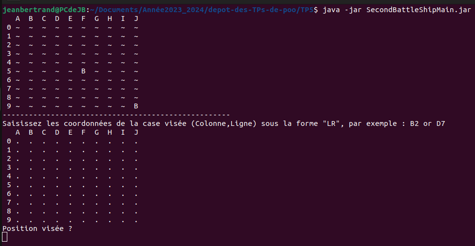
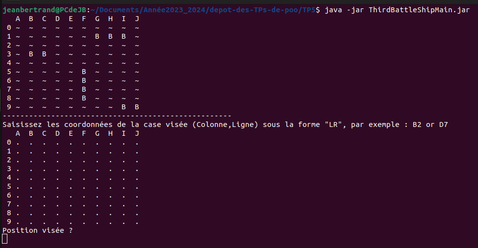

# RENDU DU TP5 - BATAILLE NAVALE

## MEMBRE DU GROUPE
*- Jean Bertrand KAMTCHOUM YONGA*

## DESCRIPTION DU TRAVAIL

*Dans ce TP, nous avons realisé le jeu tres connu de la **Battaille Navale**, l'objectif etait de realiser ce jeu grâce aux notions d'exceptions, classes enumerés, en se servant de la methode **readString** de la classe **Input**,nous permettant de recuperer une chaine entrée par l'utilisateur du jeu.Dans ce TP aucun parametre n'est fourni au programme.*

## INSTRUCTIONS, COMPILATIONS, JAVADOC, TESTS ET EXECUTION DU PROGRAMME

### INSTRUCTIONS

*Dans ce TP, on definit tout d'abord la variable d'environnement dans chacun de nos terminaux grace a la commande :*

```/TP5$ export CLASSPATH="src:classes"```

### JAVADOC

*Par la suite pour generer la javadoc de nôtre code on le fait grâce a la commande :*

```/TP5$ javadoc -sourcepath src -subpackages battleship io tv -d docs```

*Pour Consulter la Javadoc ainsi faite, il faut ouvrir le fichier **docs/index.html***

### COMPILATION DU CODE

*Pour compiler les fichiers du code on effectue la commande :*

```/TP5$ javac src/battleship/*.java -d classes```

```/TP5$ javac src/tv/*.java -d classes```

```/TP5$ javac src/io/*.java -d classes```

*Ces commandes compilent l'ensemble des classes presentes dans battleship/ et les packages io/ et tv/.*

### COMPILATION TESTS

*Pour compiler les fichier tests du code on effectue d'abord la commande qui modifie la variable d'environnement CLASSPATH.*

```/TP5$ export CLASSPATH="src:classes:test:junit-console.jar"```

*Et puis on execute la commande suivante pour compiler les fichiers tests :*

```/TP5$ javac test/battleship/*.java```

### EXECUTION TESTS

*Pour executer les tests du code on effectue la commande:*

```/TP5$ java -jar junit-console.jar -classpath test:classes -scan-classpath```

### CREATION JAR EXECUTABLE

*Pour la creation des jar(s) Executables, on utilise les commandes:*

- SecondBattleShipMain :  ```jar cvfe SecondBattleShipMain.jar battleship.SecondBattleShipMain -C classes .```

- ThirdBattleShipMain :   ```jar cvfe ThirdBattleShipMain.jar battleship.ThirdBattleShipMain -C classes .```

### EXECUTION DU PROGRAMME

*Pour executer les programmes, il faut utiliser les commandes:*

- SecondBattleShipMain : ```java -jar SecondBattleShipMain.jar```



- ThirdBattleShipMain : ```java -jar ThirdBattleShipMain.jar```



# FIN

