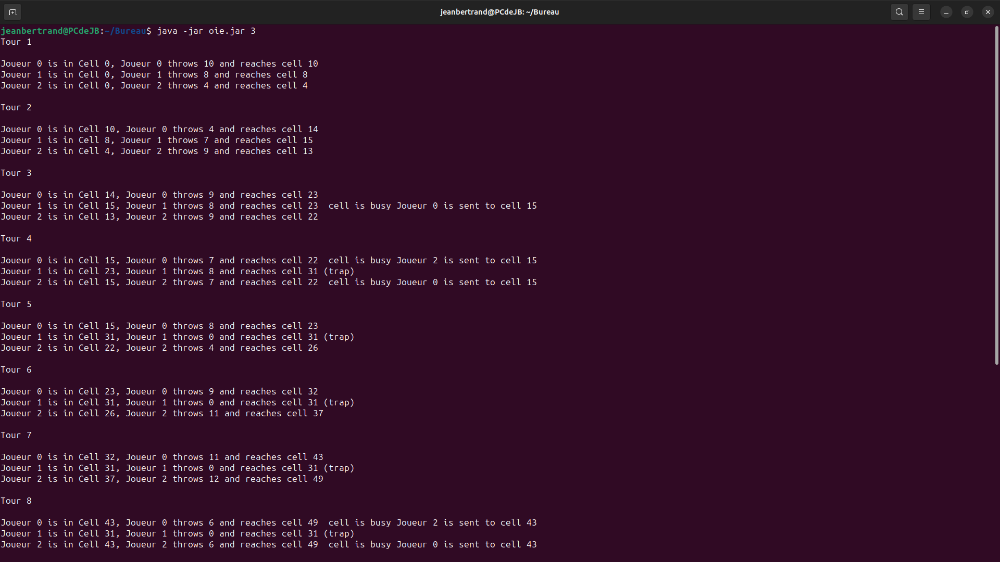
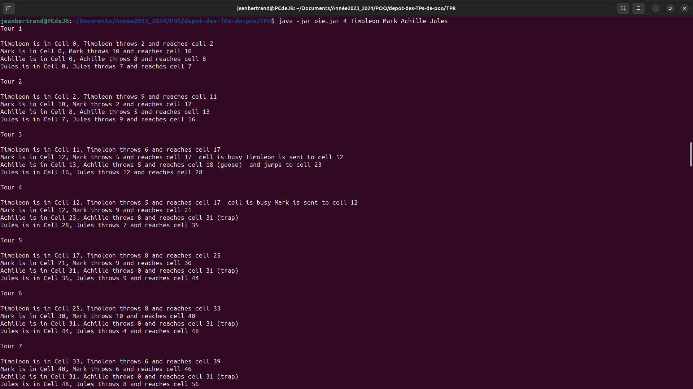

# RENDU DU TP8 - JEU DE L'OIE

## MEMBRE DU GROUPE

*- Jean Bertrand KAMTCHOUM YONGA*

## DESCRIPTION DU TRAVAIL

**JEU DE L'OIE**

*Ce jeu est joué par au moins 2 joueurs, chaque joueur possède un pion situé sur la premiere case au début. A chaque tour le joueur lance deux dés et avance du nombre du case indiqué par les dés. Certaines cases ont des effets spéciaux : la case oie fait avancer du même nombre de case, la case hotel passe 2 tours, le labyrinthe envoie sur une case en arrière alors que le pont envoie sur une case en avant, la case mort renvoie au début, la prison et le puit bloquent un joueur indéfiniement tant qu'un autre joueur ne les libère pas en arrivant sur la même case.Dans notre implementation, l'option de jeu choisie, est de n'avoir qu'un seul joueur par case aucours du jeu : ce qui implique que lorsqu'un joueur arrive sur une case occupée, il echange de case avec le joueur de la case.Le premier a arriver sur la **case 63** gagne la partie.*

*La modelisation du jeu a necessité la **notion d'heritage** pour les cases du plateau, d'avoir une **classe abstraite** pour le plateau de jeu ouvrant la possibilité de faire plusieurs types de Plateaux.*

*Le jeu prend en parametre soit le uniquement **le nombre de joueurs** (au moins 2), soit **le nombre de joueurs et les noms des joueurs***

## INSTRUCTIONS, COMPILATIONS, JAVADOC, TESTS ET EXECUTION DU PROGRAMME

### INSTRUCTIONS

*Dans ce TP, on definit tout d'abord la variable d'environnement dans chacun de nos terminaux grace a la commande :*

```/TP8$ export CLASSPATH="src:classes"```

### JAVADOC

*Par la suite pour generer la javadoc de nôtre code on le fait grâce a la commande :*

```/TP8$ javadoc -sourcepath src -subpackages goosegame -d docs```

*Pour Consulter la Javadoc ainsi faite, il faut ouvrir le fichier **docs/index.html***

### COMPILATION DU CODE

*Pour compiler les fichiers du code on effectue la commande :*

```/TP8$ javac src/goosegame/GooseGameMain.java -d classes/```

### COMPILATION TESTS

*Pour compiler les fichier tests du code on effectue d'abord la commande qui modifie la variable d'environnement CLASSPATH.*

```/TP8$ export CLASSPATH="src:classes:test:junit-console.jar"```

*Et puis on execute les commandes suivantes pour compiler les fichiers tests :*

```/TP8$ javac test/goosegame/*.java```

```/TP8$ javac test/goosegame/boards/*.java```

```/TP8$ javac test/goosegame/cells/*.java```

### EXECUTION TESTS

*Pour executer les tests du code on effectue la commande:*

```/TP8$ java -jar junit-console.jar -classpath test:classes -scan-classpath```

### CREATION JAR EXECUTABLE

*Pour la creation du jar Executable, on utilise les commandes:*

- oie.jar :  ```jar cvfe oie.jar goosegame.GooseGameMain -C classes .```

### EXECUTION DU PROGRAMME

*Pour executer le programme, il faut utiliser les commandes :*

- 1 parametre : ```java -jar oie.jar 3```



- 5 parametres : ```java -jar oie.jar 4 Timoleon Mark Achille Jules```



# FIN


