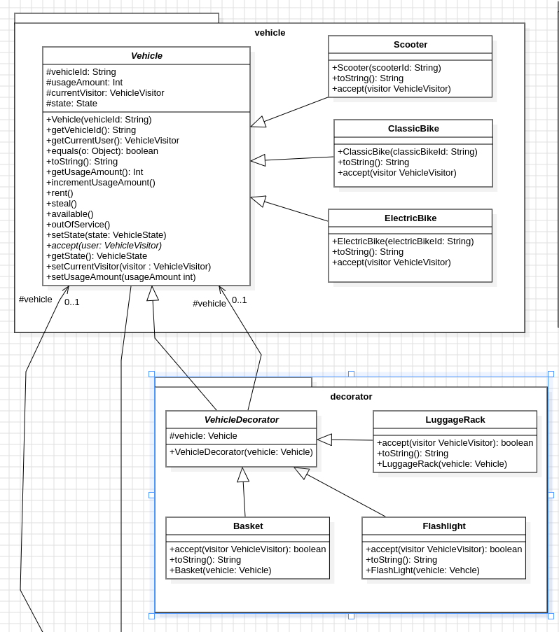
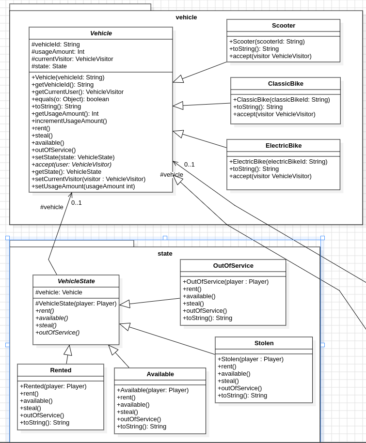
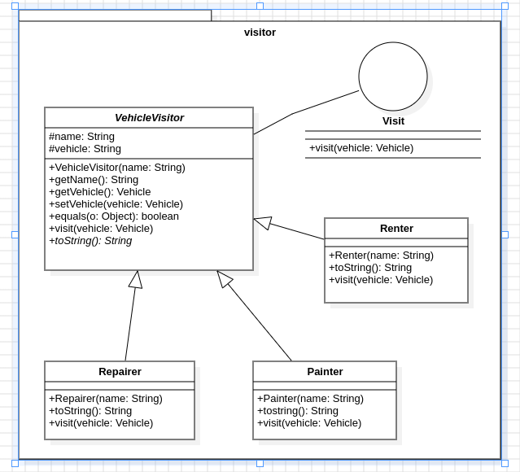
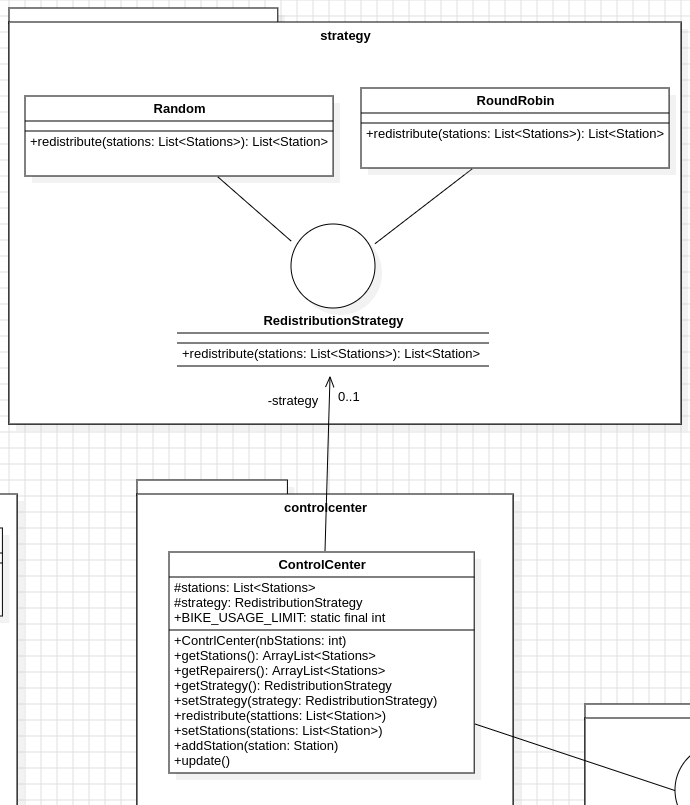
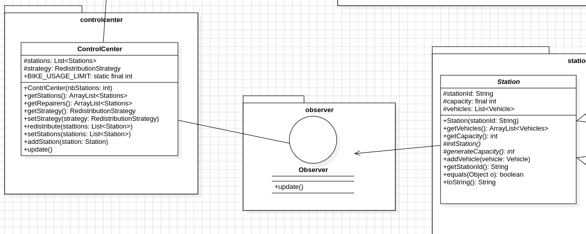

# Projet Vélos Libre Service

## Contributeurs 

- Jean Bertrand KAMTCHOUM YONGA

## HOW TO

Le script shell **projet.sh**, contient les commandes a executer pour creer la documentation, la compilation et l'execution des tests, la compilation et la creation du jar executable.

Pour l'executer il suffit de lancer la commande suivante dans le dossier racine du projet:

```bash
./projet.sh
``` 

## DESIGN PATTERN

### DECORATOR  

J'ai consideré une classe mere **Vehicle**, dont herite les classes **ClassicBike et ElectricBike**, on peut envisager de creer d'autres types de vehicules.
Grâce au design pattern decorator je peux decorer les vehicules avec des accessoires comme un panier, un porte baggage, des lumieres, etc.

On respecte le **principe de l'ouverture fermeture (Open Closed Principle)**, car on peut ajouter des accessoires aux vehicules sans avoir a modifier le code de ces vehicules.



### STATE

On souhaite savoir l'etat de chaque vehicule, on creer donc une classe **VehiculeState** abstraite qui represente l'etat du vehicule ici les velos, on considere les etats **Available**, **Rented**, **Stolen** et **OutOfService**.

On respecte le **principe de l'ouverture fermeture (Open Closed Principle)**, car on peut ajouter des etats aux vehicules sans avoir a modifier le code de ces vehicules, et le **principe de responsabilité unique (Single Responsibility Principle)**, car chaque etat a une seule responsabilite.

> Available : Lorsqu'un velo est disponible dans une station.

> Rented : Lorsqu'un velo est loué par un utilisateur.

> Stolen : Lorsqu'un velo est volé.

> OutOfService : Lorsqu'un velo est hors service.



### VISITOR 

Avec Le design pattern **Visitor**, on peut avoir plusieurs visiteurs qui vont pouvoir interagir avec des objets de type **Vehicule**, par l'intermediaire de stations de locations de velos.

Ce pattern permet de separer l'operation de visite de l'objet visité tout en evitant les requêtes de cast avant d'effectuer l'operation.

Cela est par exemple le cas lorsque le un **loueur vient louer un velo dans la station**, ou q'un **reparateur vient reparer un velo hors service**, ou qu'un **voleur vienne voler un velo**.

On peut envisage d'autres types de visiteur venir interagir avec les objets de type **Vehicule**, par l'intermediaire de stations de locations de velos.




### STRATEGY

Avec le design patter **Strategy**, on cree une famille d'algorithmes ici pour redistribuer les vehicules dans les stations. Tout en les rendants interchangeables au niveau de la classe cliente.

On respecte le **principe de l'ouverture fermeture (Open Closed Principle)**, car on peut ajouter des algorithmes de redistributions et les rendre interchangeable sans avoir a modifier le code de la classe cliente.

On respecte le **principe de responsabilité unique (Single Responsibility Principle)**, car chaque algorithmes de redistribution a une seule responsabilite.



### OBSERVER

Avec le design pattern **Observer**, on cree une famille d'observateurs qui vont pouvoir observer des objets de type **Vehicule**, par l'intermediaire de stations de locations de velos.

On respecte le **principe de l'ouverture fermeture (Open Closed Principle)**, car on peut ajouter des observateurs aux vehicules sans avoir a modifier le code de ces vehicules.



